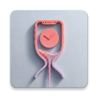

  

<h1 align="center">PhoneLimit</h1>

  Set a time limit before you open the app — stop doomscrolling before it starts.

  

  

  <a href="https://notbuiltin.github.io/phonelimit/privacy.html">Privacy Policy</a> ·
  <a href="https://notbuiltin.github.io/phonelimit/terms.html">Terms</a> ·
  <a href="https://notbuiltin.github.io/phonelimit/delete-account.html">Delete account</a> ·
  <a href="mailto:notbuiltin@gmail.com">Contact</a>

